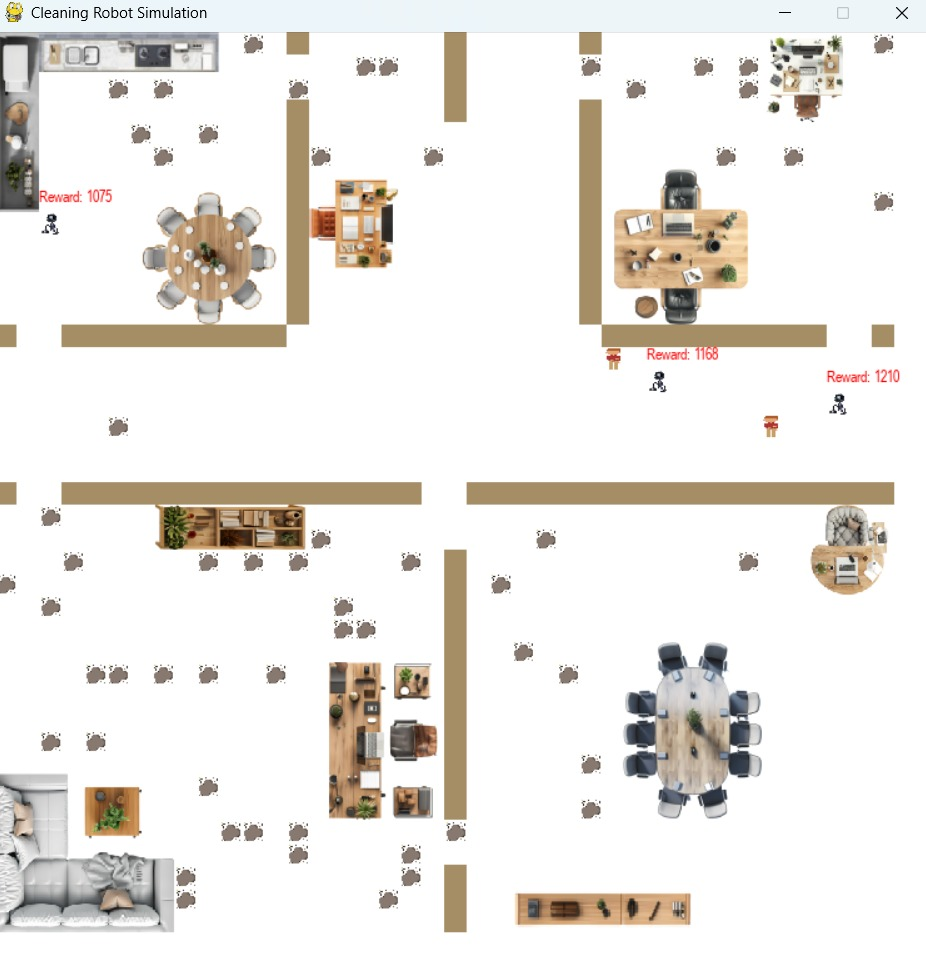

# 🤖 Intelligent Cleaning Robot

An intelligent cleaning robot simulation using **Actor-Critic Reinforcement Learning** for adaptive navigation, dust collection, and obstacle avoidance.

---

## 📌 Project Overview

This project simulates intelligent cleaning robots operating in a dynamic indoor environment.

The robots learn to navigate the environment, collect dust, avoid obstacles, and improve their behavior using **Actor-Critic Reinforcement Learning**.

---

## 🧠 Reinforcement Learning Approach

The project uses the **Actor-Critic** reinforcement learning architecture.

### 🎯 Actor

The Actor learns a policy for selecting actions based on the current state of the environment.

### 📊 Critic

The Critic evaluates the current state and provides feedback to improve the Actor's decisions.

The learning process uses **Temporal Difference (TD) Error** to update the Actor and Critic.

---

## 🏠 Simulation Environment

The simulation represents an indoor environment containing:

- 🏠 Multiple rooms
- 🧱 Walls
- 🪑 Furniture
- 🧹 Dust particles
- 🤖 Cleaning robots
- 🚧 Static and dynamic obstacles

The environment is represented as a **40 × 40 grid**.

---

## 🤖 Robot Behavior

The cleaning robots are designed to:

- Navigate through the environment
- 🧹 Collect dust
- 🚧 Avoid obstacles
- 🔄 Interact with dynamic obstacles
- 🧠 Learn improved navigation policies through reinforcement learning
- 📈 Maximize their accumulated reward

---

## 📊 Simulation Result

The following image shows the cleaning robot simulation with multiple robots navigating the environment, avoiding obstacles, and collecting dust.

---

## 🛠️ Technologies

- Python
- Pygame
- NumPy
- Reinforcement Learning
- Actor-Critic
- Path Planning
- Grid-Based Simulation

---

## 📁 Project Structure

- 📂 `images/` — Robot, obstacle, dust, furniture, and environment assets
- 📂 `results/` — Simulation results
- 📓 `cleaning_robot_actor_critic.ipynb` — Main Actor-Critic implementation
- 📄 `requirements.txt` — Project dependencies
- 📄 `.gitignore` — Files excluded from version control

---

## ▶️ How to Run

### 1. Clone the Repository

    git clone https://github.com/doniasafwat/intelligent-cleaning-robot.git

### 2. Install Dependencies

    pip install -r requirements.txt

### 3. Open the Notebook

Open `cleaning_robot_actor_critic.ipynb` using **Jupyter Notebook** or **JupyterLab**.

---

## 🎯 Project Goals

The main goal of this project is to demonstrate how **Reinforcement Learning** can be applied to autonomous robot navigation and intelligent cleaning tasks in a simulated indoor environment.

---

## 👩‍💻 Author

### Donia Safwat

**AI Graduate | Machine Learning & Deep Learning | Computer Vision**

🔗 [LinkedIn](https://www.linkedin.com/in/doniasafwat1/)

💻 [GitHub](https://github.com/doniasafwat)
